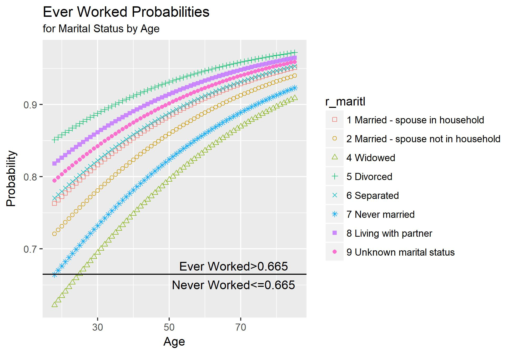
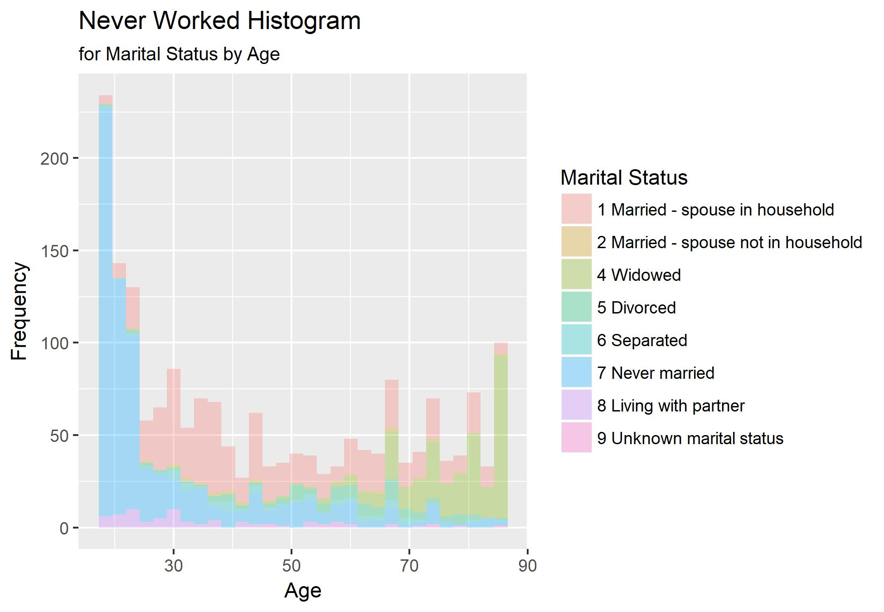
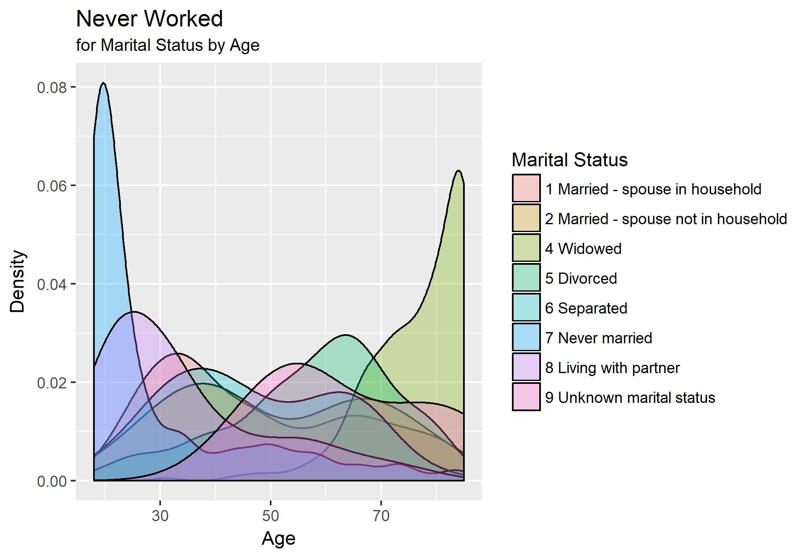

```{r setup, include=FALSE}
knitr::opts_chunk$set(echo = TRUE)
```

## Logistic Regression - Mini Project Homework

```{r Prep}
setwd("C:/Users/Tom/git/datasciencefoundation/ForestCoverage/logistic_regression/mini_project")

##   You might also start by listing the files in your working directory

getwd() # where am I?
list.files("dataSets") # files in the dataSets folder

```

## Regression with binary outcomes

### Logistic regression

This far we have used the "lm" function to fit our regression models.
"lm" is great, but limited–in particular it only fits models for
continuous dependent variables. For categorical dependent variables we
can use the "glm()" function.

For these models we will use a different dataset, drawn from the
National Health Interview Survey. From the [CDC website]:

The National Health Interview Survey (NHIS) has monitored
the health of the nation since 1957. NHIS data on a broad
range of health topics are collected through personal
household interviews. For over 50 years, the U.S. Census
Bureau has been the data collection agent for the National
Health Interview Survey. Survey results have been
instrumental in providing data to track health status,
health care access, and progress toward achieving national
health objectives.

Load the National Health Interview Survey data:
```{r "Read Data"}
NH11 <- readRDS("dataSets/NatHealth2011.rds")
labs <- attributes(NH11)$labels
labs

# [CDC website] http://www.cdc.gov/nchs/nhis.htm

```
### Logistic regression example

Let's predict the probability of being diagnosed with hypertension
based on age, sex, sleep, and bmi

```{r "Hyperventilate Logistic Regression"}
str(NH11$hypev) # check stucture of hypev
levels(NH11$hypev) # check levels of hypev
# collapse all missing values to NA
NH11$hypev <- factor(NH11$hypev, levels=c("2 No", "1 Yes"))
# run our regression model
hyp.out <- glm(hypev~age_p+sex+sleep+bmi,
              data=NH11, family="binomial")
coef(summary(hyp.out))

```
### Logistic regression coefficients

Generalized linear models use link functions, so raw coefficients are
difficult to interpret. For example, the age coefficient of .06 in the
previous model tells us that for every one unit increase in age, the
log odds of hypertension diagnosis increases by 0.06. Since most of us
are not used to thinking in log odds this is not too helpful!

One solution is to transform the coefficients to make them easier to
interpret.
```{r "Hyperventilate Coefficients"}
hyp.out.tab <- coef(summary(hyp.out))
hyp.out.tab[, "Estimate"] <- exp(coef(hyp.out))
hyp.out.tab
```
### Generating predicted values

In addition to transforming the log-odds produced by `glm' to odds, we
can use the `predict()' function to make direct statements about the
predictors in our model. For example, we can ask "How much more likely
is a 63 year old female to have hypertension compared to a 33 year old
female?".

Create a dataset with predictors set at desired levels.
```{r "Predict Hyperventilate Values"}
predDat <- with(NH11,
                expand.grid(age_p = c(33, 63),
                            sex = "2 Female",
                            bmi = mean(bmi, na.rm = TRUE),
                            sleep = mean(sleep, na.rm = TRUE)))
```
Predict hypertension at those levels.
```{r "Predict Hperventilation"}
cbind(predDat, predict(hyp.out, type = "response",
                       se.fit = TRUE, interval="confidence",
                       newdata = predDat))
```
This tells us that a 33 year old female has a 13% probability of
having been diagnosed with hypertension, while and 63 year old female
has a 48% probability of having been diagnosed.

### Packages for  computing and graphing predicted values

Instead of doing all this ourselves, we can use the effects package to
compute quantities of interest for us (cf. the Zelig package).
```{r "Hyperventilate Effects"}
library(effects)
plot(allEffects(hyp.out))
```

# Exercise: logistic regression

Use the NH11 data set that we loaded earlier.

1. Use glm to conduct a logistic regression to predict ever worked
(everwrk) using age (age_p) and marital status (r_maritl).

Note: that the data is not perfectly clean and ready to be modeled. You
will need to clean up at least some of the variables before fitting
the model.

## Data Cleaning

To begin, we look at the data to determine what needs to be cleaned.
```{r "Data Cleaning"}
str(NH11)
```
The dependent variable, 'everwrk', is a factor with 5 possibilities that 
need to be converted to a binary outcome. Examine the 'everwrk' variable
more closely to see all the values.
```{r "Data Summary"}
summary(NH11$everwrk)
table(NH11$everwrk)
```
The 'everwrk' variable can be converted to numeric by subscrpting
just the first character and converting to numeric.
```{r "Clean Everwrk"}
NH11$everwrk=as.character(NH11$everwrk) # so that we can set new values.
NH11$everwrk=substr(NH11$everwrk,1,1)   # get the first character for the value
NH11$everwrk=as.integer(NH11$everwrk)   # convert to numeric
```
Make the "No" value zero so that the outcome will have "0" meaning "never worked"
and "1" for "having worked".
```{r "Convert Everwrk to a binary"}
NH11$everwrk[NH11$everwrk == 2]<-0
table(NH11$everwrk)
```
There are only 25 rows that are not "1" or "0". Remove them from the study
by setting them to "NA".
```{r "Check modified Everwrk"}
NH11$everwrk[NH11$everwrk==7 | NH11$everwrk==9]=NA
#NH11_complete = NH11[NH11$everwrk!=7 & NH11$everwrk!=9 , ]
table(NH11$everwrk)
```
The "everwrk" outcome variable is now ready.

Look at "age_p" variable again. It is ready as a numeric independent variable 
without any "NA" entries.
```{r "Age_p cleaning"}
summary(NH11$age_p)
table(NH11$age_p)
```
Check "r_maritl", marital status next. Marital status does not have any "NA" values.
```{r "Marital Status Cleaning"}
summary(NH11$r_maritl)
```
The r_maritl variable looks good as is for use as a factor variable for the logistic 
regression. Look at other ways to represent the marital status, converting the 
value to a number by subscripting the first character of the value and another
numeric by ordering the priority from unmarried to married as follows:

* Under 14 years
* Never Married
* Unknown Marital Status
* Widowed
* Divorced
* Separated
* Living with partner
* Married - Spouse in household unknown
* Married - Spouse not in household
* Married - Spouse in household

The values will be placed into new variables, "maritlNum" and maritlPri
respectively.
```{r "Clean Marital Data"}
# Create binary variables for marriage types for possible later use
library(dplyr)
#NH11 <- mutate(NH11,r_maritlNum = 0) # Marital as numeric values
#NH11 <- mutate(NH11,r_maritlPri = 0) # Marital as numeric values, prioritized from unmarried to married

#NH11$r_maritlNum=substr(NH11$r_maritl,1,1)

#NH11$r_maritlPri[NH11$r_maritl=="0 Under 14 years"]<-0
#NH11$r_maritlPri[NH11$r_maritl=="7 Never married"]<-1
#NH11$r_maritlPri[NH11$r_maritl=="9 Unknown marital status"]<-2
#NH11$r_maritlPri[NH11$r_maritl=="4 Widowed"]<-3
#NH11$r_maritlPri[NH11$r_maritl=="5 Divorced"]<-4
#NH11$r_maritlPri[NH11$r_maritl=="6 Separated"]<-5
#NH11$r_maritlPri[NH11$r_maritl=="8 Living with partner"]<-6
#NH11$r_maritlPri[NH11$r_maritl=="3 Married - spouse in household unknown"]<-7
#NH11$r_maritlPri[NH11$r_maritl=="2 Married - spouse not in household"]<-8 
#NH11$r_maritlPri[NH11$r_maritl=="1 Married - spouse in household"]<-9

#NH11$r_maritl=as.numeric(NH11$r_maritl)
#print(summary(NH11$r_maritlNum))
#print(table(NH11$r_maritlNum))
#print(summary(NH11$r_maritlPri))
#print(table(NH11$r_maritlPri))

```
The data is cleaned except for the "NA" values for "everwrk".

To handle the "NA" values, two new datasets will be created. One will have the records
with the approximately 18000 "everwrk"="NA" records removed 
so there are only complete cases. 
This data set will be called, "NH11_complete". 
It will contain about 14000 records which should be sufficient for training and testing.

The second data set will have the "NA" values in "everwrk" updated using the impute method. 
This dataset will be called NH11_imputed and will contain the full data set.
An intermediate dataset with factors converted to numeric will be created
for use by the imputing method. 
It will be called, "NH11_numeric".

The coefficients for the logistic regression for each model will be compared to
see if there is any major difference from the two methods.

Create the NH11_complete dataset by removing records that have "everwrk"
values of "NA". Then look at the data again.
```{r "Reduce to complete 'EverWrk' cases only"}
NH11_complete=NH11[complete.cases(NH11[ , "everwrk"]),] # remove everwrk="NA" rows
NH11_complete$everwrk=as.integer(NH11_complete$everwrk)
str(NH11_complete)
summary(NH11_complete$everwrk)
table(NH11_complete$everwrk)
```

## Complete Imputed Values

Create an intermedate data frame of numeric data to use as a source to
create the imputed values for the entire data set.

The variables to include in the numeric data frame are selected. 
All variables except family and person number are included.
```{r "Complete 'NA' Values"}


do_impute=1

if (do_impute) {
  NH11_numeric=NH11[c("wtia_sa",
"wtfa_sa",
"region",
"strat_p",
"psu_p",
"sex",
"hispan_i",
"mracrpi2",
"age_p",
"r_maritl",
"everwrk",
"hypev",
"aasmev",
"aasmyr",
"dibev",
"dibage",
"difage2",
"insln",
"dibpill",
"arth1",
"arthlmt",
"wkdayr",
"beddayr",
"aflhca18",
"aldura10",
"aldura17",
"aldura18",
"smkev",
"cigsday",
"vigmin",
"modmin",
"bmi",
"sleep",
"ausualpl"
)]

  curTime=Sys.time()
  print(paste("Numeric Conversion started at",curTime))

# Convert the data to numeric as we did before

NH11_numeric$sex=as.character(NH11_numeric$sex)
NH11_numeric$sex=substr(NH11_numeric$sex,1,1)
NH11_numeric$sex=as.numeric(NH11_numeric$sex)
NH11_numeric$sex[NH11_numeric$sex == 2]<-0
table(NH11_numeric$sex)

NH11_numeric$hispan_i=as.character(NH11_numeric$hispan_i)
NH11_numeric$hispan_i=substr(NH11_numeric$hispan_i,1,2)
NH11_numeric$hispan_i=as.numeric(NH11_numeric$hispan_i)
table(NH11_numeric$hispan_i)

NH11_numeric$mracrpi2=as.character(NH11_numeric$mracrpi2)
NH11_numeric$mracrpi2=substr(NH11_numeric$mracrpi2,1,2)
NH11_numeric$mracrpi2=as.numeric(NH11_numeric$mracrpi2)
table(NH11_numeric$mracrpi2)

NH11_numeric$hypev=as.numeric(NH11_numeric$hypev)
NH11_numeric$hypev=substr(NH11_numeric$hypev,1,1)
NH11_numeric$hypev=as.numeric(NH11_numeric$hypev)
table(NH11_numeric$hypev)

NH11_numeric$aasmev=as.numeric(NH11_numeric$aasmev)
NH11_numeric$aasmev=substr(NH11_numeric$aasmev,1,1)
NH11_numeric$aasmev=as.numeric(NH11_numeric$aasmev)
table(NH11_numeric$aasmev)

NH11_numeric$aasmyr=as.numeric(NH11_numeric$aasmyr)
NH11_numeric$aasmyr=substr(NH11_numeric$aasmyr,1,1)
NH11_numeric$aasmyr=as.numeric(NH11_numeric$aasmyr)
table(NH11_numeric$aasmyr)

NH11_numeric$dibev=as.numeric(NH11_numeric$dibev)
NH11_numeric$dibev=substr(NH11_numeric$dibev,1,1)
NH11_numeric$dibev=as.numeric(NH11_numeric$dibev)
table(NH11_numeric$dibev)

NH11_numeric$insln=as.numeric(NH11_numeric$insln)
NH11_numeric$insln=substr(NH11_numeric$insln,1,1)
NH11_numeric$insln=as.numeric(NH11_numeric$insln)
table(NH11_numeric$insln)

NH11_numeric$dibpill=as.numeric(NH11_numeric$dibpill)
NH11_numeric$dibpill=substr(NH11_numeric$dibpill,1,1)
NH11_numeric$dibpill=as.numeric(NH11_numeric$dibpill)
table(NH11_numeric$dibpill)

NH11_numeric$arth1=as.numeric(NH11_numeric$arth1)
NH11_numeric$arth1=substr(NH11_numeric$arth1,1,1)
NH11_numeric$arth1=as.numeric(NH11_numeric$arth1)
table(NH11_numeric$arth1)

NH11_numeric$arthlmt=as.numeric(NH11_numeric$arthlmt)
NH11_numeric$arthlmt=substr(NH11_numeric$arthlmt,1,1)
NH11_numeric$arthlmt=as.numeric(NH11_numeric$arthlmt)
table(NH11_numeric$arthlmt)

NH11_numeric$aflhca18=as.numeric(NH11_numeric$aflhca18)
NH11_numeric$aflhca18=substr(NH11_numeric$aflhca18,1,1)
NH11_numeric$aflhca18=as.numeric(NH11_numeric$aflhca18)
table(NH11_numeric$aflhca18)

NH11_numeric$smkev=as.numeric(NH11_numeric$smkev)
NH11_numeric$smkev=substr(NH11_numeric$smkev,1,1)
NH11_numeric$smkev=as.numeric(NH11_numeric$smkev)
table(NH11_numeric$smkev)

NH11_numeric$ausualpl=as.numeric(NH11_numeric$ausualpl)
NH11_numeric$ausualpl=substr(NH11_numeric$ausualpl,1,1)
NH11_numeric$ausualpl=as.numeric(NH11_numeric$ausualpl)
table(NH11_numeric$ausualpl)

str(NH11_numeric)
summary(NH11_numeric)

set.seed(144)
library(mice)

curTime=Sys.time()
print(paste("Numeric conversion completed and data completion started at",curTime))

NH11_imputed=complete(mice(NH11_numeric))

curTime=Sys.time()
print(paste("Data Impute completed at",curTime))

summary(NH11_imputed)

} else {
  NH11_imputed = NH11_complete
}
```
It shows there were 5 rounds/iterations of imputation to fill in the missing values.

The summary shows there are no missing values. 

# Create Logistic Model Analysis Function

Before creating logistic regression models, a function that will make it easier to analyze
the accuracy of models for a range of thresholds is created. It can produce a "Confusion
Matrix", calculate the Sensitivity, specificity and accuracy of a model.

```{r "Logsitic Model Accuracy Function"}

calcLogisticModelAccuracy <- function(actualValues, predictedValues, 
                         thresholdStart, thresholdEnd, thresholdParts,
                         positiveLabel, negativeLabel, printLevel) {
  
  # Description
  #   -Calculate accuracy of logistic regression model
  #   -depending on print level option:
  #      print accuracy of logistic model and baseline model
  #      print confusion matrix
  #      print sensitivity and specificty
  #
  # Input Values
  #   -actualValues = actual values of outcome variables, a vector of 0's and 1's
  #   -predictedValues = logistic model predicted probalilities between 0 and 1
  #   -thresholdStart = threshold initial value for applying to predicted values
  #      to determine predicted outcome
  #   -thresholdEnd = end value for incrementing the threshold 
  #   -thresholdParts = number of partitions to apply threshold values between
  #      thresholdStart and thresholdEnd
  #   -positiveLabel = text to label true outcomes. This will be displayed
  #      on the confusion matrix when the print level is greater than 1.
  #   -negativeLable = text to label false outcomes. This will be displayed
  #      on the confusion matrix when the print level is greater than 1.
  #   -printLevel = level of detail printed by calcLogisticModelAccuracy
  #      0 - no printed output unless and error is encountered
  #      1 - print threshold, logistic model accuracy and baseline accuracy
  #      2 - Print level 1 and confusion matrix and sensitivity and specificity values
  #      3 - Print level 2 and details of sensitivity and specificity calculations
  #      4 - Print level 3 and debug information
  #
  # Return Values
  #   -function status: 
  #      - "OK":function completed without errors
  #      - "ERROR": function did not complete, and error information
  #         See other variables for possible additional error information
  #   -logistic model accuracy based on last threshold value tested
  #   -baseline model accuracy based on last threshold value tested
  #   -confusion matrix values in following order: TN, FN, FP, TP
  #   -sensitivity
  #   -specificity
  
  # set default values in case of errors
  accuracy=baseline=retVal="ERROR"
  
  # Calculate increment value to iterate through the threshold values
  if ( thresholdParts ==0) { thresholdParts = 1 }
  if ( thresholdParts < 0) { thresholdParts = - thresholdParts }
  thresholdInc = (thresholdEnd - thresholdStart) / thresholdParts
  if (thresholdStart==thresholdEnd | thresholdParts < 2) {
    thresholdEnd=thresholdStart
    thresholdInc=1
  }
  threshold=thresholdStart
  
  funcStat="OK"
  
  workPerformance = table(actualValues, predictedValues > threshold)
  
  for (row in rownames(workPerformance)) {
    if(row != "0" & row != "1") { 
      funcStat=paste("ERROR:Bad row name:",row,",must be '0' or '1'")}
  }
  for (col in colnames(workPerformance)) {
    if(col != "TRUE" & col != "FALSE") { 
      funcStat=paste("ERROR:Bad column name:",col,", must be 'TRUE' or 'FALSE'")}
  }
  
  if (funcStat=="OK") {
    repeat {
      
      workPerformance = table(actualValues, predictedValues > threshold)
  
      # create a modelPerformance table and set all the values to zero.
      # This ensures a 2x2 matrix in case the threshold causes all values predicted
      # to be TRUE or FALSE values and produces a 2x1 vector.
      # The table of actual and predicted values with be copied into the
      # modelPerformance table later.
      Actual = c(0, 1)
      Predicted = c(FALSE, TRUE )
      modelPerformance = table(Actual,Predicted)
      modelPerformance["0","TRUE"]=0
      modelPerformance["0","FALSE"]=0
      modelPerformance["1","FALSE"]=0
      modelPerformance["1","TRUE"]=0
  
      # Descriptions         | Predict Good Care (0) | Predict Poor Care (1)  
      # ---------------------|-----------------------|----------------------
      # Actual Good Care (0) |     TN (true neg)     |   FP (false pos)
      # Actual Poor Care (1) |     FN (false neg)    |   TP (true pos)
    
      # Remember: 0 means negative which means Good care, 
      #           1 means positive which means Poor care 
      #   (Opposite of intuition)

      # Sensitivity = TP / (TP + FN) = percent of true positives identified

      # Specificity = TN / (TN + FP) = percent of true negatives identified
  
      # transfer the workPerformance table to the final performance table
      for (row in rownames(workPerformance)) {
        for (col in colnames(workPerformance)) {
          modelPerformance[row,col]=workPerformance[row,col]
          if (printLevel > 3) { print(paste("workPerformance[",row,",",col,"]=",
                                        workPerformance[row,col]))}
        }
      }
  
      if (printLevel > 3) {print(modelPerformance) }
  
      #                  Actual,Prediction
      TP = modelPerformance["1","TRUE"]  # Predicted True (1),  and actually TRUE (1) = True Positive
      FN = modelPerformance["1","FALSE"] # Predicted False (0), but actually TRUE (1) = False 0/Negative
  
      TN = modelPerformance["0","FALSE"] # Predicted False (0), and actually False (0) = True Negative
      FP = modelPerformance["0","TRUE"] # Predicted True (1), but actually False (0) = False 1/Positive
  
      # Prevent and report divide by zero error
      if (TP+FN == 0) {
        sensitivity="ERROR:TP+FN=0"
        funcStat=sensitivity
      } else { sensitivity = TP / (TP + FN ) }
  
      # Prevent and report divide by zero error
      if (TN+FP == 0) {
        specificity="ERROR:TN+FP=0"
        funcStat=specificity
      } else { specificity = TN / (TN + FP) }
  
      retVal = c(modelPerformance, sensitivity,specificity) # TN, FN, FP, TP, sens, spec
 
      if (printLevel > 2) {
        modelPerformance["1","TRUE"]  = paste("   ",modelPerformance["1","TRUE"], "(TP)")
        modelPerformance["1","FALSE"] = paste("   ",modelPerformance["1","FALSE"],"(FN)")
        modelPerformance["0","FALSE"] = paste("   ",modelPerformance["0","FALSE"],"(TN)")
        modelPerformance["0","TRUE"]  = paste("   ",modelPerformance["0","TRUE"], "(FP)")
      }
  
      c1=paste("FALSE=Predict:",negativeLabel,sep="")
      c2=paste("TRUE=Predict:",positiveLabel,sep="")
      r1=paste("0=Actual:",negativeLabel,sep="")
      r2=paste("1=Actual:",positiveLabel,sep="")
      colnames(modelPerformance) <- c(c1,c2)
      rownames(modelPerformance) <- c(r1,r2) 
  
      if (printLevel > 1) {
        print(paste("Model Performance for threshold=", threshold))
        print("predicted performance=")
        print(modelPerformance)
    
        sensPrint=paste("Sensitivity=",sensitivity,"(True positive rate of",positiveLabel)
    
        specPrint=paste("Specificity=",specificity,"(True negative rate of",negativeLabel)
    
        if (printLevel > 2 ) {
          sensPrint=paste(sensPrint,"= TP/(TP+FN) =",TP,"/(",TP,"+",FN,"))")
          specPrint=paste(specPrint,"= TN/(TN+FP) =",TN,"/(",TN,"+",FP,"))")
        }
    
        print(sensPrint)
        print(specPrint)
      }
    
      # Calculate actual true and actual false totals to calculate baseline accuracy
      # and logistic model accuracy
      totSamples=TP+FN+TN+FP
      actTrue=TP+FN
      actFalse=TN+FP
  
      # double check there were actually some non-zero values  
      if (totSamples>0) {
        if (actTrue > actFalse) { 
          baseline = actTrue / totSamples 
          baseModel= positiveLabel
        } else { 
          baseline = actFalse / totSamples 
          baseModel=negativeLabel
        }
        
        # the accuracy is the number of TRUE positives and True negatives 
        # divided by the number of samples
        accuracy=(TP+TN)/totSamples
      } else {
        baseModel="ERROR:0 samples"
        baseline="ERROR:0 samples"
        accuracy="ERROR:0 samples"
        funcStat=accuracy
      }
  
      if (printLevel > 0) {
        
        printAcc=(as.integer(accuracy*1000000))/1000000
        printbaseline=(as.integer(baseline*1000000))/1000000
    
        print(paste("Threshold=",threshold,", Logistic Accuracy=",printAcc,
                ", Baseline (",baseModel,") Accuracy=",printbaseline,sep=""))
      }

      c(funcStat,accuracy,baseline,retVal)
      
      #print(paste("threshold=",threshold,",End=",thresholdEnd,",Inc=",thresholdInc))
  
      threshold=threshold+thresholdInc
      if(thresholdEnd < thresholdStart) {
        if (threshold < thresholdEnd) { break}
      } else { if (threshold > thresholdEnd) { break} }
  
    }
  } else { 
    # Had an error, just return the error information
    print(funcStat)
  }
  
  c(funcStat,accuracy,baseline,retVal)
}

```

# Create Logistic Regression model for NH11_complete Data

Returning back to the exercise now that the data has been cleaned and NA values imputed.

1. Use glm to conduct a logistic regression to predict ever worked
(everwrk) using age (age_p) and marital status (r_maritl).

Split data into training and testing data for the NH11_complete data.
```{r "Split Data into training and test"}
library(caTools)
set.seed(144)
split = sample.split(NH11_complete$everwrk, 0.65) # we want 65% in the training set
NH11_complete_train = subset(NH11_complete, split == TRUE)
NH11_complete_test  = subset(NH11_complete, split == FALSE)
```

There are `r nrow(NH11_complete_train)` rows in the training set and 
`r nrow(NH11_complete_test)` rows in the testing set.

## Create Logistic Model for complete data

Now create the logistic model for the NH11_complete data.

```{r "Create Logistic Model with Numeric Marital Data"}

NH11_comp_ModelLog = glm(everwrk ~ age_p + r_maritl , data=NH11_complete_train, family=binomial)
```

Let's check the coefficients.

```{r "Examine Logistic Model Output"}

summary(NH11_comp_ModelLog)

```
The intercept, age, widowed, Divorced, Never Married and Living with Partner are the
most significant variables. The marriage factors adding to possibility of EverWrk are:
Divorced and Living with Partner. Widowed and Never Married have negative coefficients
pushing the probability lower favoring NeverWorked. 

## Predict the Probability of Working with Complete Data

Predict the probability of working for training data.
```{r Prediction}

# Complete Model Data

predict_comp_Train= predict(NH11_comp_ModelLog, type="response")
summary(predict_comp_Train)
```
Predict the probability of working for training data.
```{r}
predict_comp_Test= predict(NH11_comp_ModelLog, type="response", newdata=NH11_complete_test)
summary(predict_comp_Test)

```
Next, look at the True Positive and False Positive rates based on threshold value.
```{r "ROCR"}

library(ROCR)

ROCRpred = prediction(predict_comp_Train, NH11_complete_train$everwrk)
ROCRperf = performance(ROCRpred, "tpr", "fpr")
plot(ROCRperf, colorize=TRUE, print.cutoffs.at=seq(0,1,0.1), text.adj=c(-0.2,1.7))
```

Find Threshold Value that gives the best accuracy.  Call the calcLogisticModelAccuracy
function with the coutcome variable from the training set, 'NH11_complete_train$everwrk',
the probabilities from the predict function, 'predict_comp_Train', a range of threshold
values from 0.0 to 1.0 in 10 steps, labels for the false and true predictions
and a printLevel of 1 to report just the accuracy for each threshold.

```{r "Predict complete"}

result = calcLogisticModelAccuracy (NH11_complete_train$everwrk, predict_comp_Train, 
                       0.0, 1, 10, "EverWorked", "NeverWorked", 1)
result
```
The best threshold is between 0.6 and 0.8. Examine the range more closely.

```{r}
result = calcLogisticModelAccuracy (NH11_complete_train$everwrk, predict_comp_Train, 
                       0.6, 0.8, 20, "EverWorked", "NeverWorked", 1)
```
We are getting closer, lets look between 0.65 and 0.67.
```{r}
result = calcLogisticModelAccuracy (NH11_complete_train$everwrk, predict_comp_Train, 
                       0.65, 0.67, 20, "EverWorked", "NeverWorked", 1)
result
```
There are several threshholds that give the highest accuracy. 
Let's choose 0.66. The accuracy of the logistic model is only 0.3%
better than the baseline model. The logistic model does not give us much 
improvement. It is what we have for this assignment.
```{r}
result = calcLogisticModelAccuracy (NH11_complete_train$everwrk, predict_comp_Train, 
                       0.66, 0.66, 1, "EverWorked", "NeverWorked", 1)
result
```
Now apply the model to the test data.
```{r}

result = calcLogisticModelAccuracy (NH11_complete_test$everwrk, predict_comp_Test, 
                       0.66, 0.66, 1, "EverWorked", "NeverWorked", 3)
result

```
There is improved accuracy on the test data at 87.01%, but, again, only about 0.45% 
better than the baseline model for the test data.

# Imputed Data Model

The imputed data is examined next to see if it makes any difference on the test data.

## Create Logistic Regression model for NH11_imputed Data

Create the logistic model for the NH11_imputed data. Start by creating the
test and training data.
```{r "Create Imputed Model Training and Testing data"}
set.seed(144)
split = sample.split(NH11_imputed$everwrk, 0.65) # we want 65% in the training set
NH11_imputed_train = subset(NH11_imputed, split == TRUE)
NH11_imputed_test  = subset(NH11_imputed, split == FALSE)
```

There are `r nrow(NH11_imputed_train)` rows in the training set and 
`r nrow(NH11_imputed_test)` rows in the testing set.

Create the logistic regression model for the NH11_imputed data.
```{r "Calculate Logistic Model for Imputed Data"}
NH11_imp_ModelLog = glm(everwrk ~ age_p + r_maritl , data=NH11_imputed_train, family=binomial)
```

Check the coefficients for the imputed data model.

```{r "Examine Imputed Model"}
summary(NH11_imp_ModelLog)
```
Look at the coefficients for the "complete data" logistic model again.
```{r "Review Complete Data Model Coefficients"}
summary(NH11_comp_ModelLog)
```
The coefficients for the models are within a factor of 2 of each other. 
The imputed data logistic model variables have the same significance except for
'Living with partner' which is now highly significant.

Find the best threshold for the imputed data. Start by looking at 0 through 1 in 0.1
increments.
```{r "Predict Imputed"}
predict_imp_Train= predict(NH11_imp_ModelLog, type="response")
summary(predict_imp_Train)

result = calcLogisticModelAccuracy (NH11_imputed_train$everwrk, predict_imp_Train, 
                       0.0, 1.0, 10, "EverWorked", "NeverWorked", 1)
```
Check the range between 0.6 and 0.8 more closely.
```{r}
result = calcLogisticModelAccuracy (NH11_imputed_train$everwrk, predict_imp_Train, 
                       0.6, 0.8, 20, "EverWorked", "NeverWorked", 1)
```
Further refine checing 0.66 through 0.68.
```{r}
result = calcLogisticModelAccuracy (NH11_imputed_train$everwrk, predict_imp_Train, 
                       0.66, 0.68, 20, "EverWorked", "NeverWorked", 1)
```
A threshold value of 0.665 gives the best accuracy.
```{r}
result = calcLogisticModelAccuracy (NH11_imputed_train$everwrk, predict_imp_Train, 
                       0.665, 0.665, 1, "EverWorked", "NeverWorked", 3)                     
```
Determine the accuracy of the imputed model on the imputed test data.
```{r "Predict Imputed Test"}
predict_imp_Test = predict(NH11_imp_ModelLog, type="response", newdata=NH11_imputed_test)
summary(predict_imp_Test)

result = calcLogisticModelAccuracy (NH11_imputed_test$everwrk, predict_imp_Test, 
                       0.665, 0.665, 1, "EverWorked", "NeverWorked", 3)
```


Now determine the accuracy of the imputed model on the complete test data. 
This is the real test is to determine which model is better.
```{r "Predict Imputed Complete Test"}
predict_imp_comp_Test = predict(NH11_imp_ModelLog, type="response",
      newdata=NH11_complete_test)
summary(predict_imp_Test)

result = calcLogisticModelAccuracy (NH11_complete_test$everwrk, predict_imp_comp_Test, 
                       0.665, 0.665, 1, "EverWorked", "NeverWorked", 3)
```
The accuracy of the imputed model on the complete test data is 87.01% which is the
same for the complete data model. Both models produce the same results. This could
be expected since the imputed data will most likely be proportional to the
complete data. The imputed data model will be used for the rest of the assignment
since the variables are more significant than in the complete data model.

# Predict 'EverWrk' based on Marital Status

Exercise Part 2. Predict the probability of working for each level of marital status.

As in the example, convert the coefficients so they can be more easily understood.


```{r "Convert Everwork Coefficients"}
ImpModel.out <- coef(summary(NH11_imp_ModelLog))
ImpModel.out[, "Estimate"] <- exp(coef(NH11_imp_ModelLog))
ImpModel.out
```

## Predict Everwork for each Marital Status

Create a test data frame to use against the imputed model to compute everwrk
based on marital status. The average age will be used.
```{r "Predict Ever Worked for Average Age"}

predDat <- with(NH11,
                expand.grid(age_p= mean(age_p, na.rm = TRUE),
                          #  r_maritl=c(dimnames(table(NH11$r_maritl)))
                          r_maritl=c("1 Married - spouse in household",
                                     "2 Married - spouse not in household",
                                     "4 Widowed",
                                     "5 Divorced",
                                     "6 Separated",
                                     "7 Never married",
                                     "8 Living with partner",
                                     "9 Unknown marital status"
                                     )
                            )
                )
```
Now bind the results to the data frame.
```{r}

cbind(predDat, predict(NH11_imp_ModelLog, type = "response",
                       se.fit = TRUE, interval="confidence",
                       newdata = predDat))
```
With a threshold of 0.665, the fit predicts Ever Worked is true for 
each marital status. This is not a very good predictor since we know
from data clean up there are 1887 of the 14,040 rows where everwork is false.

Create another data set to examine marital status for each age and see
where the model predicts, never having worked.
```{r "Predict Ever Worked for each Age"}

predDat <- with(NH11,
                expand.grid(#age_p= mean(age_p, na.rm = TRUE),
                            age_p= c(18:85),
                          #  r_maritl=c(dimnames(table(NH11$r_maritl)))
                          r_maritl=c("1 Married - spouse in household",
                                     "2 Married - spouse not in household",
                                     "4 Widowed",
                                     "5 Divorced",
                                     "6 Separated",
                                     "7 Never married",
                                     "8 Living with partner",
                                     "9 Unknown marital status"
                                     )
                            )
                )
```
Bind the response probabilities to the data.
```{r "Bind Predictions"}
graphData=cbind(predDat, predict(NH11_imp_ModelLog, type = "response",
                       se.fit = TRUE, interval="confidence",
                       newdata = predDat))
```
Now plot the results of age and marital status. The threshold line of 0.665
is included for reference.
```{r}
library(ggplot2)

#cutoff <- data.frame( x = c(-Inf, Inf), y = 0.66, cutoff = factor(0.66) )

#     geom_line(aes( x, y, linetype = cutoff ), cutoff) +

g <- ggplot(graphData,aes(age_p, fit, col=r_maritl)) +
       geom_point(alpha=0.9,aes(shape=r_maritl)) +
       scale_shape_manual(values=c(0,1,2,3,4,8,15,16))+
       geom_hline(yintercept = 0.665) + 
       annotate("text", min(graphData$age_p)+50, 0.658, vjust = -1, label = "Ever Worked>0.665") +
       annotate("text", min(graphData$age_p)+50, 0.632, vjust = -1, label = "Never Worked<=0.665") +
       labs(title = 'Ever Worked Probabilities',
              subtitle = 'for Marital Status by Age',
              x="Age", y="Probability")+
              #colour = "Marital Status") 
      # scale_fill_discrete(name = "Marital Status")
         # theme(axis.text.x = element_text(angle=-90))
  ggsave("Fig-EverWrk_Prob_age_maritl.jpg")
```



The "Everworked Probabilities", Figure 1, 
shows that regardless of age, Everwork is predicted to be true for each 
marital status except, "Never Married" for age 18 and "Widowed" for ages 18 through 24.

Let's look at the records where Everwork==0 (FALSE) and see the histogram for 
each age group.
```{r}
NH11Never<-NH11_complete[NH11_complete$everwrk==0,]
print(paste("There are",nrow(NH11Never),"cases that have never worked."))

g <- ggplot(NH11Never,aes(age_p, fill=r_maritl)) +
       geom_histogram(alpha=0.3) + #,aes(shape=r_maritl)) +
       scale_shape_manual(values=c(0,1,2,3,4,8,15,16))+
       labs(title = 'Never Worked Histogram',
              subtitle = 'for Marital Status by Age',
              x="Age", y="Frequency") +
       scale_fill_discrete(name = "Marital Status")
         # theme(axis.text.x = element_text(angle=-90))
  ggsave("Fig-NeverWrk_hist_age_maritl.jpg")
```



The "Never Worked Histogram", Figure 2, 
shows there is a larger grouping of "never worked" at the younger ages, especially for 
"never married" which would be expected. At the higher age ranges there is a slightly 
higher number of "never worked" for "widowed" which also makes sense. 
There is a fairly consistent number of "never worked" for "Married, spouse in household" 
across all age groups which also makes sense. 

It's hard to see all of the marital status in this graph. Let's look at a density plot.

```{r}
g <- ggplot(NH11Never,aes(age_p, fill=r_maritl)) +
       geom_density(alpha=0.3) + #,aes(shape=r_maritl)) +
       scale_shape_manual(values=c(0,1,2,3,4,8,15,16))+
       labs(title = 'Never Worked',
              subtitle = 'for Marital Status by Age',
              x="Age", y="Density") +
       scale_fill_discrete(name = "Marital Status")
         # theme(axis.text.x = element_text(angle=-90))
  ggsave("Fig-NeverWrk_Dens_age_maritl.jpg")
```



The individual marital status' are a little bit easier to see 
in the "Never Worked Density", Figure 3,
and the conclusions are about the same.

# Conclusion

This was a very interesting assignment in terms of cleaning data and learning
the tools for logistic regression. Despite the logistic model being pretty
poor, this was a good way experience logistic regression.

There may be better parameters to predict everwork but exploring
what variables would enhance the model was not the goal of this assighment.